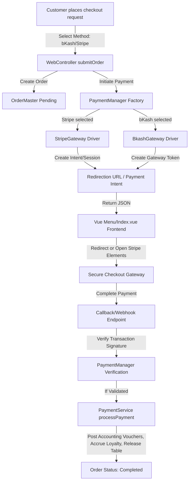

# Implementation Plan: Polymorphic Payment Gateway Integration

This plan outlines the architecture and execution steps to integrate online payment gateways (Local: **bKash/SSLCommerz**, International: **Stripe**) into the ResDine ecosystem. We will implement a professional **Factory-based Polymorphic Payment Driver** system to allow clean, modular expansion of gateways without cluttering core checkout services.

---

## Architecture Design



---

## Proposed Technical Blueprint

We will create a clean payment gateway abstraction layer.

### 1. The Gateway Abstraction layer

#### [NEW] [PaymentGatewayInterface.php](file:///e:/laragon/www/resdine/app/Contracts/PaymentGatewayInterface.php)
Defines the standard operational methods that any gateway driver (bKash, SSLCommerz, Stripe, PayPal) must implement:
```php
namespace App\Contracts;

use App\Models\OrderMaster;
use Illuminate\Http\Request;

interface PaymentGatewayInterface
{
    /**
     * Initiate payment and return session payload or redirect URL.
     */
    public function initiatePayment(OrderMaster $order, float $amount, string $callbackUrl): array;

    /**
     * Verify payment status following returning from gateway.
     */
    public function verifyPayment(Request $request): array;

    /**
     * Process refunds through the gateway.
     */
    public function refund(string $transactionId, float $amount): bool;
}
```

#### [NEW] [PaymentManager.php](file:///e:/laragon/www/resdine/app/Services/Payments/PaymentManager.php)
A Manager factory subclassing Laravel's standard manager class to resolve active drivers on-demand based on the selection:
```php
namespace App\Services\Payments;

use Illuminate\Support\Manager;

class PaymentManager extends Manager
{
    public function getDefaultDriver()
    {
        return config('services.payment.default', 'stripe');
    }

    public function createStripeDriver()
    {
        return new StripeGateway();
    }

    public function createBkashDriver()
    {
        return new BkashGateway();
    }
}
```

---

### 2. Driver Implementations

#### [NEW] [StripeGateway.php](file:///e:/laragon/www/resdine/app/Services/Payments/StripeGateway.php)
Leverages the official Stripe SDK to construct payment intent sessions.
* **Initiation:** Generates a Stripe Checkout Session or returns a Client Secret for Stripe Elements on the front-end.
* **Verification:** Validates Stripe signatures via secure webhook payloads (`stripe-signature`).

#### [NEW] [BkashGateway.php](file:///e:/laragon/www/resdine/app/Services/Payments/BkashGateway.php)
Leverages bKash Tokenized Checkout Merchant APIs.
* **Initiation:** Sends a POST request to bKash API `/tokenized/checkout/create` to get secure bkashURL.
* **Verification:** Triggers bKash execute payment URL `/tokenized/checkout/execute` and parses response status codes.

---

### 3. Controller & Callback Endpoints

#### [MODIFY] [WebController.php](file:///e:/laragon/www/resdine/app/Http/Controllers/WebController.php)
Update checkout to handle dynamic gateway redirection:
```diff
                 // 2. Handle Instant Payment for Takeaway/Delivery
                 if ($validated['payment_method']) {
+                    // If online payment (bKash/Stripe)
+                    if (in_array($validated['payment_method'], ['bkash', 'stripe'])) {
+                        $gateway = app(PaymentManager::class)->driver($validated['payment_method']);
+                        $initiation = $gateway->initiatePayment($order, $validated['total_amount'], route('payment.callback', $validated['payment_method']));
+                        return response()->json([
+                            'success' => true,
+                            'redirect_url' => $initiation['redirect_url'] ?? null,
+                            'client_secret' => $initiation['client_secret'] ?? null,
+                        ]);
+                    }
+                    // Otherwise cash/manual process
                     $this->paymentService->processPayment($order, [
                         'amount' => $validated['total_amount'],
                         'payment_method' => $validated['payment_method'],
```

#### [NEW] [PaymentCallbackController.php](file:///e:/laragon/www/resdine/app/Http/Controllers/PaymentCallbackController.php)
Handles redirect requests back from payment gateways:
```php
namespace App\Http\Controllers;

use App\Services\Payments\PaymentManager;
use App\Services\PaymentService;
use App\Models\OrderMaster;
use Illuminate\Http\Request;

class PaymentCallbackController extends Controller
{
    public function handleCallback(Request $request, $gatewayName)
    {
        $gateway = app(PaymentManager::class)->driver($gatewayName);
        $result = $gateway->verifyPayment($request);

        if ($result['status'] === 'success') {
            $order = OrderMaster::findOrFail($result['order_id']);
            app(PaymentService::class)->processPayment($order, [
                'amount' => $result['amount'],
                'payment_method' => $gatewayName,
                'transaction_reference' => $result['transaction_id']
            ]);

            return redirect()->route('web.order.success', ['order' => $order->order_number])
                             ->with('success', 'Payment successful!');
        }

        return redirect()->route('web.menu.index')->with('error', 'Payment verification failed: ' . $result['message']);
    }
}
```

---

### 4. Configuration & Environment Settings

#### [MODIFY] [services.php](file:///e:/laragon/www/resdine/config/services.php)
Register secure credentials:
```php
'payment' => [
    'default' => env('DEFAULT_PAYMENT_GATEWAY', 'stripe'),
],
'stripe' => [
    'key' => env('STRIPE_KEY'),
    'secret' => env('STRIPE_SECRET'),
    'webhook_secret' => env('STRIPE_WEBHOOK_SECRET'),
],
'bkash' => [
    'app_key' => env('BKASH_APP_KEY'),
    'app_secret' => env('BKASH_APP_SECRET'),
    'username' => env('BKASH_USERNAME'),
    'password' => env('BKASH_PASSWORD'),
    'sandbox' => env('BKASH_SANDBOX', true),
],
```

---

## Verification & Testing Plan

### 1. Automated/Staging Sandbox Validation
* **Stripe CLI Test Webhooks:**
  Run `stripe listen --forward-to localhost:8000/api/webhooks/stripe` to forward mock webhook events.
* **bKash Simulator Credential testing:**
  Utilize mock credential pins `01770618575` and dynamic OTP codes inside sandboxed redirection links.

### 2. Manual Verification
* Go to the public menu page, build a cart, choose "Stripe Checkout", checkout, and complete a test transaction using card number `4242 4242 4242 4242`. Verify that the page redirects back to the menu and issues a successful, completed receipt invoice.
